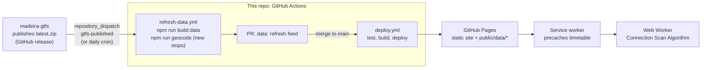

# How madeira-bus-planner works

This is the long-form explanation of what this app does and how: the
problem it solves, how the timetable gets from the source feed into your
browser, how journeys are computed with no server, and how the UI handles
the awkward cases. For setup and commands, see the
[README](../README.md).

- [1. The problem](#1-the-problem)
- [2. The approach](#2-the-approach)
- [3. From feed to browser: the data path](#3-from-feed-to-browser-the-data-path)
- [4. Build time: packing the feed](#4-build-time-packing-the-feed)
- [5. Run time: planning a journey in the browser](#5-run-time-planning-a-journey-in-the-browser)
- [6. The planner contract and edge states](#6-the-planner-contract-and-edge-states)
- [7. The UI](#7-the-ui)
- [8. Offline, deployment and testing](#8-offline-deployment-and-testing)
- [9. Limitations](#9-limitations)

---

## 1. The problem

Madeira's buses are run by four operators: Horários do Funchal (HF),
Rodoeste, CAM and Aerobus. Only HF published machine-readable data. The
rest of the island's timetables existed only as PDFs on the regional
portal, SIGA. No navigation app could answer questions like "how do I get
from Funchal to Porto Moniz?" or "is there still a bus back from Machico
tonight?". You had to find the right PDFs, read them, and work out the
connections yourself.

The sister project
[madeira-gtfs](https://github.com/mischelboss/madeira-gtfs) solves the
data half. It turns the PDFs and the HF feed into a single island-wide
[GTFS](https://gtfs.org) feed; its
[`docs/how-it-works.md`](https://github.com/mischelboss/madeira-gtfs/blob/main/docs/how-it-works.md)
explains how. A GTFS file on its own still doesn't help someone standing
at a bus stop, though. This repo is the rider-facing half: a journey
planner built on that feed.

## 2. The approach

The goals shaped the architecture:

| Goal | What it means in practice |
|---|---|
| Free to run, no accounts | A static site on GitHub Pages. No backend and no database. |
| Works with poor or no signal (rural Madeira, mountain roads) | Every calculation runs on the device, and the timetable is cached for offline use. |
| Mobile first | A small installable PWA with a fast first search. |
| Honest answers | A past date, a date beyond the published timetable, or "no more buses today" are shown explicitly, never as an empty list. |
| Easy to add a server later | All planning goes through one `TripPlanner` interface that a remote implementation could replace. |

The key decision is **client-side routing**. The whole island's
timetable is about 230,000 bus movements between consecutive stops. Packed
into a compact binary file, that's about 1.3 MB compressed, small enough
to download once and search in the browser in milliseconds.

## 3. From feed to browser: the data path

1. When madeira-gtfs publishes a feed, it sends a `gtfs-published` event
   to this repo. A daily cron runs as well, so the "how far ahead can I
   plan" horizon keeps moving even without a new feed.
2. `refresh-data.yml` downloads the feed and rebuilds `public/data/`.
   It then reverse-geocodes any new stops and rebuilds again.
3. If the output changed, the workflow opens a PR titled
   `data: refresh feed (…)`. **Data changes are reviewed like code
   changes**, not pushed straight to production.
4. Merging to `main` runs `deploy.yml`, which runs the tests, builds, and
   deploys to GitHub Pages.

`madeira-gtfs` is a private repo, so the fetch authenticates with a
`GTFS_REPO_TOKEN` secret (see the README and `src/lib/fetchFeed.ts`).

## 4. Build time: packing the feed

*Code: `scripts/build-data.ts`, `scripts/geocode-stops.ts`,
`src/planner/timetableFormat.ts`*

`npm run build:data` converts the GTFS zip into files under
`public/data/`. It is **deterministic**: the same feed and the same
geocode cache always produce byte-identical output, so a refresh with no
real change produces no diff and no PR.

### Checking the feed first

The script first checks that the feed has the shape it expects: dates
only in `calendar_dates.txt`, a start and end date in `feed_info.txt`,
and well-formed times. If a check fails, the build stops with a clear
message instead of producing a subtly wrong timetable.

### What gets built

| File | Contents | Used by |
|---|---|---|
| `timetable.bin.gz` (~1.3 MB) | The routing blob: connections, trips, service calendars, stop coordinates, footpaths | The routing worker |
| `stops.json`, `routes.json`, `headsigns.json`, `agencies.json` | Names, colours and metadata, index-aligned with the blob | The main thread (turning numbers into text) |
| `browse.json`, `route-times.json` | The route catalogue and per-stop timetables | The Browse tab |
| `shapes.json`, `route-shapes.json` | Route geometry | The map (loaded only when opened) |
| `meta.json` | Feed version, validity dates, counts | Everything |

### The routing blob

`timetable.bin` is one `ArrayBuffer` with a small header and a series of
typed-array sections, so it loads with no copying and no parsing. The
worker never sees a string ID or a time zone, only numbers:

- **Connections**, sorted by departure time. A connection is one bus
  moving from one stop to the next: departure stop, arrival stop,
  departure time, arrival time, trip, and pickup/drop-off flags. Times
  are seconds from local midnight on the service day, and can be 24:00
  or later for trips that run past midnight.
- **Trips**: route, service calendar, direction and headsign for each.
- **Service calendars**: one bitset per service, one bit per day of the
  feed's validity. "Does this trip run on 14 March?" is a single bit
  lookup.
- **Footpaths**: which stops you can walk between, and how long it
  takes. Stops within 150 m are linked, then extended transitively up to
  400 m. Walk time uses 1.1 m/s and a 1.3 detour factor on the
  straight-line distance, with a minimum of 60 s. Footpaths make
  cross-operator transfers work where two operators' stops stand a few
  metres apart.

### Making stops readable

Operator stop names are written for the operator, not for riders:
`"AV Mar  E E M (11)"`. Two build-time steps help, and both are
**derived, never invented**:

- **Towns.** Every stop is reverse-geocoded once through Nominatim, at
  1 request per second. The result is cached in
  `data/geocode-cache.json`, which is committed, so CI only ever looks up
  new stops. Search results show the town, which tells apart the many
  stops called "Igreja" or "Centro".
- **Street names.** A second pass (`npm run geocode -- --roads`) records
  the street each stop is on. `src/lib/stopNames.ts` uses that street as
  the display name only when the operator's own words appear in it. For
  example, "AV Mar" matches "**Av**enida do **Mar** e das Comunidades
  Madeirenses". Otherwise the name printed on the stop sign is kept
  exactly as it is, because a name the rider can match to the sign beats
  a prettier one that might point somewhere else.

Several poles of one physical stop (same code or name, within 60 m) are
grouped, so the stop search lists them once.

## 5. Run time: planning a journey in the browser

*Code: `src/planner/`*

### The algorithm: Connection Scan

Routing uses the
[Connection Scan Algorithm](https://arxiv.org/abs/1703.05997) (CSA),
implemented in `src/planner/csa.ts` and run inside a Web Worker
(`csa.worker.ts`) so the UI never freezes. CSA suits a network of this
size well:

1. Mark the origin stops as reachable at the departure time. Starting
   from a map point or your location, every stop within walking distance
   is an origin, each with its own walk time.
2. Go through all connections once, in departure order. A connection can
   be used if you can reach its departure stop in time, either by
   already riding that trip or by getting there with at least a 90 s
   transfer margin. If it gets you to its arrival stop earlier than
   before, record that, then spread the improvement along footpaths.
3. Stop once no remaining connection could beat the best arrival at the
   destination. Rebuild the journey by following the recorded choices
   backwards.

The worker is purely numeric. The main thread (`LocalPlanner.ts`)
converts the result back into stop names, routes and ISO times.

### Time zones and midnight

The caller passes the UTC instant of local midnight (Atlantic/Madeira)
for each service day. A connection's real time is then just "that
midnight + its seconds", so daylight-saving changes and after-midnight
times (such as `25:10:00`) need no special handling. Each search loads
the day before, the day itself and the following days, so a trip that
started yesterday evening but is still running is included.

### Several options, not just the fastest

A single CSA pass finds the earliest arrival. To offer a choice, the
planner repeats the search, each time departing a minute after the
previous result's first bus, until it has up to four itineraries. It
then removes the pointless ones: an itinerary is dropped if another one
leaves at the same time or later, arrives at the same time or earlier,
and needs no more transfers. Walking time is deliberately not part of
that comparison, because many riders prefer more walking and fewer
changes.

### When nothing is found

If nothing runs in the next few days, the search widens to about three
weeks ahead. If there's no trip today at all, the search looks forward
for a single "next bus" answer. The UI shows that as "no more buses
today, next one leaves Tuesday 06:40", not as an empty result.

## 6. The planner contract and edge states

*Code: `src/planner/types.ts`, `src/planner/deriveFlags.ts`*

The UI talks only to the `TripPlanner` interface: `plan()`,
`listStops()` and `nearbyStops()`. `LocalPlanner` is the only
implementation today. The interface is designed so that a
`RemotePlanner` calling an HTTP routing server could replace it with no
UI change:

- Every date and time is an ISO 8601 string with an offset, never a
  `Date` object. The same JSON could cross a network unchanged.
- Only plain objects cross the interface: no typed arrays and no worker
  handles.

The awkward cases are **explicit fields on the result**, computed by one
shared pure function (`deriveFlags`), so any future server would behave
the same way:

| Flag or outcome | Situation | What the rider sees |
|---|---|---|
| `dateAdjustedFromPast` | The chosen time is in the past | The search runs from now, and a banner says so |
| `beforePublishedHorizon` | The feed doesn't start until later | The search starts on the feed's first day, with an explanation |
| `beyondPublishedHorizon` | The date is after the last published day | A banner says the timetable isn't published that far ahead yet |
| `noMoreServiceToday` + `nextDeparture` | Nothing left today | A "no more buses" card with the next departure |
| `origin_unreachable` / `destination_unreachable` | No stop within walking distance | The nearest stop and how far it is |
| `no_route` | Stops exist but nothing connects them | A plain "no route" message |

## 7. The UI

*Code: `src/screens/`, `src/components/`, `src/map/`*

Two tabs:

- **Search.** From/To fields with autocomplete (MiniSearch: prefix and
  fuzzy matching, accent-insensitive, name and town), a date and time,
  and then the results. Each itinerary card shows its legs with coloured
  line badges and walking segments, and expands to the full stop
  sequence. A map view draws each leg in its line's colour and can show
  your live location.
- **Browse.** The whole network in two lists. *Regional* holds routes
  whose two ends lie in the same region (Funchal, Câmara de Lobos, West
  Coast, North, East), grouped by that region. *Interregional* holds
  routes that cross between regions. A filter matches line numbers and
  place names. Each route has a detail page with weekday and weekend service
  hours, typical frequency, the full stop list, a timetable, and a map.

There's no router library. **The URL query string is the whole
navigation state** (`src/state/nav.ts`), so every search and route page
can be bookmarked and shared, and the browser's Back button works even
when a deep link was opened directly.

The map (MapLibre GL with OpenStreetMap tiles) is split into its own
bundle and only loads when you tap **Map**, which keeps the first load
small.

## 8. Offline, deployment and testing

**Offline.** The app is a PWA (`vite-plugin-pwa`). The service worker
precaches the app and the routing blob, so after the first visit
planning works with no connection. Route shapes (about 4 MB) and map
tiles are cached on first use instead of up front.

**Deployment.** `npm run build` produces a static `dist/`, which
`deploy.yml` publishes to GitHub Pages under `/madeira-bus-planner/`.

**Testing.**

- `npm test` runs Vitest with jsdom. It covers the CSA algorithm, the
  flags, stop search, stop names, navigation, and screen components.
- `npm run smoke:browser` drives a production build in real Chrome and
  checks that the map actually draws a route line. That needs its own
  test because jsdom has no WebGL, and the MapLibre failures that matter
  come from the bundler and only show up in a production build.

## 9. Limitations

- **The planner is only as complete as the feed.** Some SIGA lines
  aren't in the feed yet: unsupported PDF layouts, unreadable PDFs, or
  stops that still need coordinates. madeira-gtfs's
  [`docs/coverage-inventory.md`](https://github.com/mischelboss/madeira-gtfs/blob/main/docs/coverage-inventory.md)
  tracks them.
- **Some arrival times are estimates.** For lines whose PDFs give only
  departure times at each end, the feed estimates arrival times from
  distance and marks them as approximate.
- **There's no real-time data.** Everything comes from the published
  timetable, not live vehicle positions.
- **The planning horizon is the feed's validity.** Planning beyond
  `feed_end_date` isn't possible, and the UI says so.
